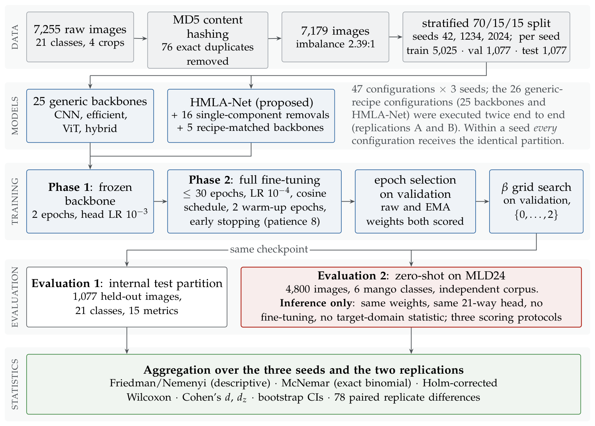
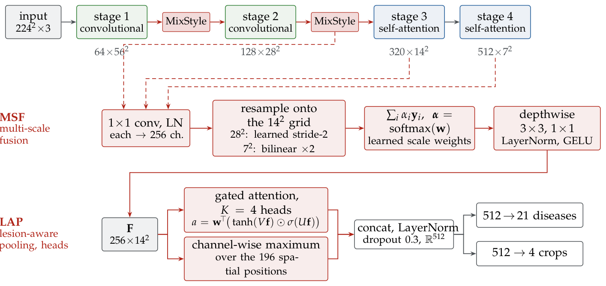

# HMLA-Net: Hierarchical Multi-scale Lesion-Attention Network for multi-crop leaf disease classification

Official code of the paper

> **Saturated In-Domain, Separable Out-of-Domain: A Hierarchical Multi-Scale Lesion-Attention Network and a Zero-Shot Cross-Corpus Protocol for Multi-Crop Leaf Disease Classification**
> Songul Karakus, Mehmet Burukanli and Davut Ari
> Department of Computer Engineering, Bitlis Eren University, Turkiye, 2026.
>
> **Note:** the manuscript is currently under review at *Symmetry* (MDPI). Full citation
> details will be added upon publication.

**Code version 1.0** (September 2026). This release is the code that produced the results
of the manuscript under review. Should the revision process change any of the reported
experiments, an updated version will be released under a new tag; the version history is
kept in the repository tags and in `CITATION.cff`.

The repository contains the complete experimental pipeline used in the paper: the proposed
model, 25 ImageNet-pretrained baselines under one shared training recipe, a 17-variant
ablation, multi-seed statistics, zero-shot cross-corpus (external) validation, calibration
and explainability outputs. Every step is resumable, so the whole study can be run with a
single command on one GPU.

<p align="center">
  
</p>

---

## 1. The model

HMLA-Net adds four light components to a **CAFormer-S18** backbone (MetaFormer; the first
two stages are convolutional, the last two use self-attention; ImageNet-22k pretrained,
fine-tuned on ImageNet-1k, loaded from `timm`):

<p align="center">
  
</p>

```
input [B,3,224,224]
  └─ CAFormer-S18 (features_only, out_indices=(1,2,3))
       stages_0 ─► MixStyle          [B, 64, 56, 56]
       stages_1 ─► MixStyle          [B,128, 28, 28] ─┐
       stages_2                      [B,320, 14, 14] ─┤ three scales
       stages_3                      [B,512,  7,  7] ─┘
  └─ MSF   multi-scale fusion (stride-16 grid)   [B,256,14,14]   ◄── Grad-CAM target
  └─ LAP   lesion-aware attentive pooling (MIL)  [B,512]         ◄── t-SNE embedding
  └─ LayerNorm → Dropout
  └─ fc_disease [B,21]  +  fc_plant [B,4]  (auxiliary head)
```

| Component | What it does | Ablation switch |
|---|---|---|
| **MSF** — multi-scale fusion | Projects the stride-8/16/32 stages to 256 channels and fuses them on the stride-16 grid with softmax-normalised learned scale weights; the fine scale is reduced with a learned depthwise stride-2 convolution instead of average pooling. Gives a 14×14 (instead of 7×7) map for Grad-CAM. | `wo_msf` |
| **LAP** — lesion-aware attentive pooling | Treats the leaf as a bag of patches (multiple-instance learning). Gated attention (Ilse et al., 2018) with 4 heads and a learned temperature, concatenated with a max-pooled branch; the attention map is kept for gradient-free explanations. | `wo_lap`, `wo_lap_gate` |
| **Hierarchical plant head** | An auxiliary 4-way plant classifier trained with weight λ = 0.3. At inference the two heads are fused, `logit[c] = logit_disease[c] + β · log p(plant_of[c])`, with **β selected on the validation set** over the grid {0, 0.1, 0.2, 0.3, 0.5, 0.75, 1, 1.5, 2} (0 is included, ties go to the first value). | `wo_hier`, `wo_beta_calib` |
| **MixStyle** | Mixes feature statistics inside the batch after the first two stages (p = 0.5, α = 0.1) to reduce reliance on background style. | `wo_mixstyle` |
| Test-time augmentation | Four views: identity, horizontal flip, vertical flip, 180° rotation (the flip group of the leaf, which has no canonical orientation). Softmax outputs are averaged. | `wo_tta` |

Measured at 224×224 on the experiment machine: **23.9 M parameters, 3.97 GFLOPs**, 11.4 ms per
image for a single pass and 45.5 ms with the four TTA views (batch size one, RTX A4000). The
added modules account for 0.66 M parameters; the bare backbone with a plain `timm` head has
24.3 M.

## 2. Training recipe

All 26 models are trained with the same data splits, image size, schedule and selection
rule (`leafdx/config.py`). The proposed model additionally uses the components above plus
MixUp/CutMix, EMA, layer-wise learning-rate decay and TTA; the paper's recipe-matched control
(Section 4.5) gives the same extras to five strong baselines.

| Setting | Value |
|---|---|
| Image size / batch | 224 × 224 / 32 |
| Phase 1 (frozen backbone) | 2 epochs, AdamW, lr 1e-3 |
| Phase 2 (whole network) | 30 epochs, AdamW, lr 1e-4, weight decay 1e-4, 2 warm-up epochs + cosine |
| Layer-wise LR decay (proposed) | γ = 0.75 across backbone stages; no decay on norms, biases and learned scalars |
| Regularisation | label smoothing 0.1, dropout 0.3 (head), RandomErasing p = 0.25, MixUp 0.2 / CutMix 1.0 with p = 0.8 switched off for the last 8 epochs (proposed) |
| Sampling | class-balanced `WeightedRandomSampler` |
| EMA (proposed) | decay derived from the step count (3-epoch horizon) with warm-up; every epoch the better of the raw and EMA weights is kept |
| Model selection / early stopping | validation macro-F1, patience 8 |
| Mixed precision | on (TF32 enabled on Ampere GPUs) |
| Seeds | 42, 1234, 2024 (one stratified 70/15/15 split per seed, shared by all models) |

## 3. Repository layout

```
leafdx/                 library
  config.py             RunConfig, the 25 baselines, the proposed configuration, ablation variants
  models.py             HMLA-Net (MixStyle, MSF, LAP, hierarchical head) and the baseline factory
  engine.py             two-phase training loop, EMA, LLRD, TTA evaluation, β calibration, resume
  data.py               indexing, MD5 de-duplication, stratified splits, external-set mapping
  metrics.py            accuracy, macro/weighted F1, sensitivity/specificity, G-mean, AUC, ECE, ...
  stats.py              Friedman + Nemenyi, Wilcoxon, McNemar (exact), bootstrap CI, Holm correction
  runner.py             one (model, seed) run end to end, master CSV
  viz.py                confusion matrix, ROC/PR, reliability diagram, t-SNE, CD diagram
run_all.py              single-command driver (dataset report → benchmark → ablation → analysis → XAI → report)
run_benchmark.py        25 baselines + proposed model, multi-seed, resumable
run_ablation.py         17 ablation variants
run_external.py         zero-shot evaluation of saved checkpoints on an external corpus (no retraining)
run_optuna.py           optional hyper-parameter search (not used for the reported runs)
analyze.py              summary tables, statistics, CD diagram
gradcam.py              Grad-CAM and LAP attention grids
dataset_report.py       exploratory data analysis figures
make_report.py          Markdown report of all outputs
train.py / predict.py   simple single-model path and single-image prediction
tools/                  supervisor (auto-restart), external-result collector, result archiver
mld24_map.json          MLD24 folder → class mapping used for the external validation
paper/                  partition files, derived numbers and the scripts that regenerate the paper's tables and figures
docs/                   figures used in this README
```

## 4. Installation

Python 3.10 or 3.11 is recommended. Install a CUDA build of PyTorch first, then the rest:

```bash
git clone https://github.com/songulkarakus/HMLA-Net.git
cd HMLA-Net
python -m venv .venv
source .venv/bin/activate            # Windows: .venv\Scripts\activate
pip install torch torchvision --index-url https://download.pytorch.org/whl/cu121
pip install -r requirements.txt
python -c "import torch; print(torch.cuda.is_available())"   # should print True
```

The reported runs used Python 3.11.5, torch 2.5.1+cu121, torchvision 0.20.1, timm 1.0.28,
NumPy 2.4.4, scikit-learn 1.9.0 and SciPy 1.17.1 on Windows 10 with one NVIDIA RTX A4000
(16 GB). `results/environment.json` is written at the start of every benchmark run.

## 5. Data

Both corpora are public and are **not** redistributed here.

**Internal corpus** (training, validation and test): the multi-crop leaf disease data set of
Srabon et al. (Mendeley Data, doi:[10.17632/3xd9n7jpc8.1](https://doi.org/10.17632/3xd9n7jpc8.1)).
Four plants, 21 classes, 7,255 images; 76 byte-identical duplicates are removed by MD5 hash at
indexing time, leaving 7,179. Place it as

```
multiple leaf dataset/
  cashew leaf/<class>/*.jpg
  jackfruit leaf/<class>/*.jpg
  mango leaf/<class>/*.jpg
  tomato leaf/<class>/*.jpg
```

The 21 classes (the plant name is the first word of every class folder, which is how the
hierarchical head derives its groups): cashew fungal infection, cashew healthy; jackfruit
algal, anthracnose, healthy, leaf spot, phyllosticta, sooty mold; mango anthracnose, die back,
gall midge, healthy, powdery mildew, sooty mould; tomato bacterial spot, blight, curl virus,
healthy, insect damage, leaf mold, spider mites.

**External corpus** (zero-shot evaluation only): MLD24, a mango leaf disease data set with six
classes of 800 images each (Mendeley Data,
doi:[10.17632/6dvpywm2m2.1](https://doi.org/10.17632/6dvpywm2m2.1)). Place it as
`external dataset/MLD24/<Class>/*.jpg`; `mld24_map.json` maps its folder names to the six
matching internal mango classes. Macro metrics on the external set are computed over the
classes that actually occur in it (see `leafdx/metrics.py`).

## 6. Reproducing the paper

The full study is 129 training runs (26 models × 3 seeds + 17 ablation variants × 3 seeds);
the reference execution completed 128 of them (one ablation seed failed on a resume error and is
marked as such in the paper) in about 23.5 GPU-hours on the RTX A4000. Every step writes checkpoints and `DONE`
markers, so an interrupted command can simply be re-run.

```bash
# 1) in-domain benchmark + ablation + analysis + XAI + report (resumable)
python run_all.py --seeds 42,1234,2024 --batch_size 32 --no_external

# 2) zero-shot external validation of every saved checkpoint on MLD24 (inference only)
python run_external.py --external_dir "external dataset/MLD24" --external_map mld24_map.json \
    --split_name external_mld24 --experiments benchmark,proposed,ablation

# 3) collect the MLD24 results into their own folder and refresh the summaries
python tools/collect_external.py --split external_mld24 --out results_MLD24
python analyze.py
```

Useful options: `--models resnet50,convnext_tiny` (subset), `--seeds 42` (single seed),
`--kfold 10` (cross-validation blocks instead of seeds), `--deterministic` (deterministic cuDNN),
`--select_metric val_acc`, `--patience`, `--epochs`. `python run_all.py --quick --models resnet18`
runs an end-to-end smoke test in a few minutes. On Windows `tools\auto_run.bat` starts a
supervisor that restarts the pipeline after a crash or reboot.

Each run folder `results/<experiment>/<model>/seed<seed>/` contains `config.json`,
`best.pth`, `history.csv`, `metrics_test.json`, `per_class_test.csv`,
`predictions_test.npz` (`y_true`, `y_pred`, `y_prob`), `complexity.json`, `selection.json`
(chosen epoch, EMA/raw source, calibrated β) and the diagnostic figures. `analyze.py` writes
`summary_internal_test.csv`, `proposed_vs_baselines.csv` (Wilcoxon and paired t with Holm
correction, Cohen's d), `mcnemar.json`, `ablation_summary.csv`, `cd_diagram.png` and
`stats_report.json` into `results/`.

A note on power: with three seeds the smallest two-sided Wilcoxon p-value is 0.25 and the
Nemenyi critical difference for 26 models spans most of the rank axis, so the multi-seed tests
cannot declare in-domain differences significant; the code prints this warning. The
McNemar test on the shared test set uses the exact binomial form when fewer than 25
discordant pairs exist.

## 7. Headline numbers

Reference execution reported in the paper (three seeds, mean ± s.d.):

| Split | Accuracy | Macro-F1 | Rank among 26 models |
|---|---|---|---|
| Internal test (21 classes) | 0.9882 ± 0.0014 | 0.9845 ± 0.0012 | 1st by both metrics |
| MLD24, zero-shot (6 classes) | 0.6994 ± 0.0116 | 0.6739 ± 0.0225 | 1st by accuracy, 4th by macro-F1 |

Two points the paper makes explicitly and that the code reproduces:

* **In-domain performance is saturated.** All 26 models lie within 1.7 pp of macro-F1 and a
  complete second execution of the benchmark reproduced every internal score within
  0.34 pp on average but re-ordered the ranking (HMLA-Net moved from 1st to 8th). In-domain
  ranks should therefore be read as ties.
* **Out-of-domain performance is separable.** On MLD24 the accuracies of the same models
  span 47 pp. HMLA-Net has the highest accuracy in both executions (0.699 and 0.704), but
  the recipe-matched control in the paper shows that this margin over strong baselines is
  within run-to-run variation, so the paper does not attribute it to the architecture.

The full tables, per-image predictions of both executions and the scripts that regenerate
every table and figure of the manuscript are provided as the paper's supplementary material.

## 8. Partition files, derived numbers and the paper's scripts

`paper/` contains the exact train / validation / test partitions of the three seeds with their SHA-256
fingerprints (`paper/partitions/`), every number quoted in the manuscript (`paper/output/numbers.json`),
the LaTeX bodies of the generated tables (`paper/output/tables/`) and the scripts that derive all of them
from the archived run outputs of both executions of the benchmark (`paper/scripts/`). The archived run
outputs themselves (about 280 MB of per-image predictions) are distributed as the paper's supplementary
material; `paper/README.md` explains how to run the chain on top of them.

## 9. Single-image prediction

```bash
python predict.py --ckpt results/proposed/Proposed_HMLA_CAFormerS18/seed42/best.pth \
    --image path/to/leaf.jpg --tta --topk 3
```

`train.py` is a stand-alone script that trains one plain `timm` classifier with the same data
handling; it is not used for the paper's results.

## 10. Citation

If you use this code, please cite the paper (under review at *Symmetry*, MDPI; the citation
will be completed upon publication) and the two data sets:

```bibtex
@misc{karakus2026hmlanet,
  title   = {Saturated In-Domain, Separable Out-of-Domain: A Hierarchical Multi-Scale
             Lesion-Attention Network and a Zero-Shot Cross-Corpus Protocol for
             Multi-Crop Leaf Disease Classification},
  author  = {Karakus, Songul and Burukanli, Mehmet and Ari, Davut},
  year    = {2026},
  note    = {Under review at Symmetry (MDPI); citation details will be added upon publication}
}
```

Machine-readable metadata is in `CITATION.cff`.

## 11. License

The code is released under the MIT License (see `LICENSE`). The data sets belong to their
respective authors and are distributed under their own licences.

Corresponding author: Songul Karakus, skarakus@beu.edu.tr.
